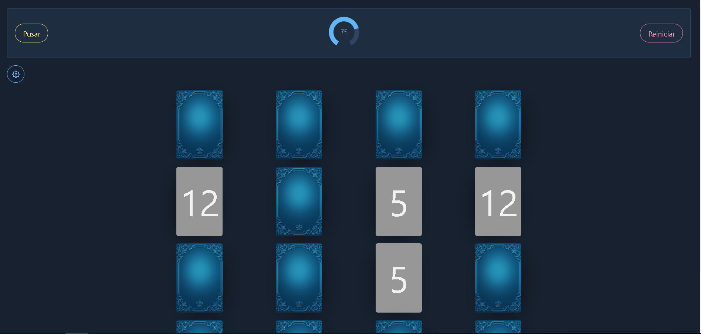
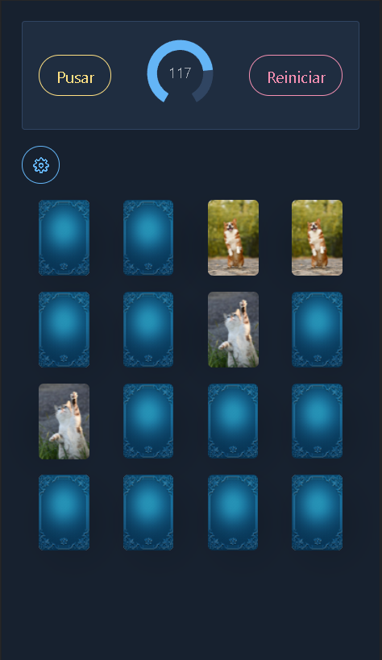
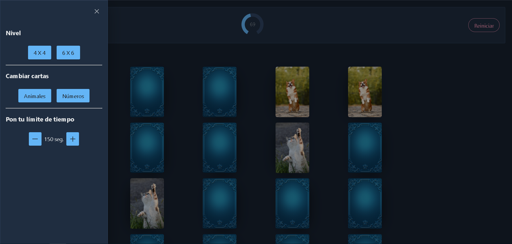
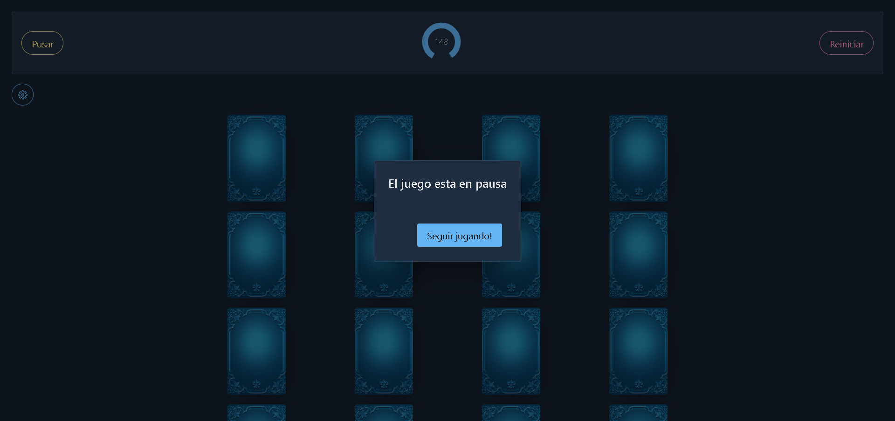
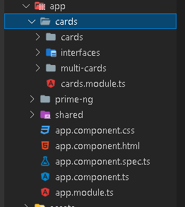

## Table of contents

- [Overview](#overview)
  - [The challenge](#the-challenge)
  - [Screenshot](#screenshot)
  - [Links](#links)
- [My process](#my-process)
  - [Built with](#built-with)
  - [Process](#process)
  - [What I learned](#what-i-learned)
  - [Useful resources](#useful-resources)


## Overview

### The challenge
Build a memory game.

Users should be able to:

-View the optimal layout for the game depending on their device´s screen size.
-See hover states for all interactive elements on the page Play the Memory game either solo or multiplayer (up to 4 players).
-Set the theme to use numbers or icons within the tiles Choose to play on either a 6x6 or 4x4 grid.

### Screenshot







### Links

- Solution URL: [MemoryGame](https://memory-gm.herokuapp.com/)


## My process

### Built with

- Semantic HTML5 markup
- CSS custom properties
- PimeNG
- PrimeFlex
- Desktop-first workflow
- Mobile-second workflow
- [Angular](https://angular.io/) - Angular framework


### Process
#### Get started

First we are going to create a new angular application.

```shell
ng new cardMemory
```
To work with the styles and the dynamic elements we use PrimeNg, so we will do the installation.

```shell
npm install primeng primeicons
```
The configuration process of PrimeNg can be found on its official page at the following link:
[PrimeNG](https://primefaces.org/primeng/showcase/#/setup)

Now, within the application we will create a new module with the following command:

```shell
ng g m primeNg
```

The function of this module is to import and export the PrimeNG own modules that are required, it is a way to better organize the code.
This will look something like this:

```js
import { NgModule } from '@angular/core';

//PrimeNG
import {ButtonModule} from 'primeng/button';
import {ToolbarModule} from 'primeng/toolbar';
import {ConfirmationService} from 'primeng/api';
import {ConfirmDialogModule} from 'primeng/confirmdialog';


@NgModule({
  exports:[
    ButtonModule,
    ToolbarModule,
    ConfirmDialogModule

  ],
  providers: [ConfirmationService]
})
export class PrimeNgModule { }
```
Now we will create a new module which will contain most of the project, within the module folder we will have the following:

- One component for the design of a letter.
- One interface to control the type of data.
- One component for the representation of all the cards.

So far we have the following:



#### Interface

Inside the "interfaces" folder we are going to create a file called "card.interface.ts" inside which we are going to define the interface for our cards variable. That is, our letter will have the following properties:

- One number for each card.
- 3 possible states in which the letter could be found.

Remaining as follows:
```js
export interface CardFormat {
  number: number;
  state: 'default' | 'flipped' | 'matched';
}
```

#### Cards component (child)

Now we will create a new component for the design and animation of our letters with the following command:

```shell
ng g c cards/cards
```
Now inside our cards.component.html we will have the following structure for a single letter:
```html
<div class="text-layout">
    <div class="cardG" (click)="takeCard.emit()" [@cardFlip]="data.state">
      <div class="face">
          
      </div>
      <div class="face front">
          <p>{{data.number}}</p>
      </div>
    </div>
</div>
```
The [@cardFlip] refers to the trigger that will allow the transition to flip the card, it will be defined later.
Within our cards.component.css we will have the following:

```css
:host {
  display: block;
  perspective: 600px;
}

.cardG {
  box-shadow: 10px 10px 43px -18px rgba(0, 0, 0, 0.75);
  border-radius: 5px;
  height: 150px;
  width: 100px;
  cursor: pointer;
  position: relative;
  transform-style: preserve-3d;
}

.face {
  display: flex;
  position: absolute;
  width: 100%;
  height: 100%;
  border-radius: inherit;
  backface-visibility: hidden;
  background-color: #979797;
  text-align: center;
  justify-content: center;
  align-items: center;
  font-size: 5rem;

}
img {
  width: 100%;
  height: 100%;
  object-fit: cover;
  border-radius: inherit;
}

.front {
  transform: rotateY(180deg);
}

```
Now is the time to create the respective animations to be able to apply them to our letter, supported by Angular animations, official documentation can be found at the following link [Angular animations] (https://angular.io/guide/animations).

Therefore within our cards.componen.ts we will define our trigger called 'cardFlip' which will contain two possible states, default and flipped, as well as their respective transitions when going from one state to another, the "flipped" state is what we It will allow us to rotate our letter 180 degrees and thus be able to see the front face of it.

```js
import {trigger,state,style,animate,transition} from '@angular/animations';

@Component({
  selector: 'app-cards',
  templateUrl: './cards.component.html',
  styleUrls: ['./cards.component.css'],
  animations: [
    trigger('cardFlip', [
      state('default', style({
        transform: 'none'
      })),
      state('flipped', style({
        transform: 'rotateY(180deg)'
      })),
      transition('default => flipped', [
        animate('400ms')
      ]),
      transition('flipped => default', [
        animate('400ms')
      ])
    ])
  ]

})
```
Finally, within the same file, we establish the input and the output to communicate the child component with the parent component that we will define later.

```js
export class CardsComponent implements OnInit {

  @Input() data: CardFormat= {
    number: 0,
    state: "default"
  };


  @Output() takeCard = new EventEmitter();

  constructor() { }

  ngOnInit(): void {
  }

}
```

The @output emits the click event with which we will execute the function to flip the cards, this function will be defined later in the parent component, while the @input will receive the letter object, from which we will take its current state in order to execute the trigger already defined before.


#### MultiCards component (parent)

This component will be in charge of drawing all the cards randomly, as well as executing the functions to flip and compare the cards to determine if they are the same.

We create a new module

```shell
ng g c cards/multiCards
```
Inside the multi-cards.component.html we put the following:

```html
<div class="card mt-5">
  <div class="card-container flex align-items-center justify-content-center">
      <div class="grid w-11 lg:w-7 ">
        <app-cards class="col-6 md:col-4 lg:col-3" *ngFor="let card of cards; let i=index" [data]="card" (takeCard)="takeCard(i)"></app-cards>
    </div>
  </div>
</div>

```

All the classes used are proper to PrimeNG, and are only to accommodate the elements in the DOM.
With the app-cards tag we make use of the cards component created previously, while with a * ngFor directive we represent each of the cards.

While on the side of the multi-cards.component.ts we have the following:

 - First we create an array with the number that each card will contain.

```js
  cardNumbers: number[] = [5,6,7,8,9,10,11,12];
```
- We create a property of type CardFormat, which is the directive we created earlier, within this property each of the letters will be stored.

```js
  cards: CardFormat[] = [];
```

Next we create the following function that will be in charge of creating a pair of each card with the corresponding object type.
```js
  objectCard(){
    this.cards = [];
    this.cardNumbers.forEach((numberCard) =>{
      const coupleCard: CardFormat = {
        number: numberCard,
        state: 'default'
      };

      this.cards.push({...coupleCard});
      this.cards.push({...coupleCard});
    });

    this.cards = this.mixCards(this.cards);

  }

  mixCards(arrayCards: any[]): any[] {

    return arrayCards.sort(() => Math.random() - 0.5);

  }
```
With the function above, the arrangement of the cards with their corresponding pair is created, but nevertheless they are next to each other, therefore it is necessary to shuffle the arrangement, this is achieved with the following function:

```js
    mixCards(arrayCards: any[]): any[] {

    return arrayCards.sort(() => Math.random() - 0.5);

  }

```

```js
   ngOnInit(): void {

      this.objectCard();
  }

```
In this way we can already represent each letter on the screen with the * ngFor directive.
```html
<app-cards class="col-6 md:col-4 lg:col-3" *ngFor="let card of cards; let i=index" [data]="card" (takeCard)="takeCard(i)"></app-cards>

```
Inside our ngOnInit we start the objectCard function every time the application starts.

#### Flip the cards

Now we create the function to be able to flip each card depending on its position, we determine this with the index:

```js
  numberCards: CardFormat[] = [];

  takeCard(index: number){

    let cardflipped = this.cards[index];

    if (cardflipped.state === 'default' && this.numberCards.length < 2)
    {
      cardflipped.state = 'flipped';
      this.numberCards.push(cardflipped);

      if (this.numberCards.length === 2) {
        this.checkForCardMatch();
     }

    } else if (cardflipped.state === 'flipped') {
      cardflipped.state = 'default';
      this.numberCards.pop();

    }

  };

```

The number of cards turned over is stored in the "numberCards" property, which is an arrangement of the CardFormat type. By evaluating the state of each card and the number of cards turned over, we can make a decision, in case the cards turned over are equal to 2 then we will call the following function:

```js
  checkForCardMatch(): void {
    setTimeout(() => {
      const card1 = this.numberCards[0];
      const card2 = this.numberCards[1];
      const compare = card1.number === card2.number ? 'matched' : 'default';
      card1.state = compare;
      card2.state = compare;

      this.numberCards = [];

      if (compare === 'matched') {
        this.cardsOk++;
        card1.state = 'flipped';
        card2.state = 'flipped';
        this.numberCards = [];
      }

    }, 1000);
  }

```
With the previous function we compare the number of each card and evaluate if they are equal, in case they are equal we assign them the "flipped" state so that they remain flipped, in case they do not correspond then we return them to their state " default ".


#### ToolBar and Timer

It is necessary to add a toolbar since it is this that we will group the necessary buttons to make the game more interactive, such as displaying a timer, placing reset, start and pause buttons, as well as selecting the number of players for the game.

We create a new component called toolBar inside the "shared" folder:

```shell
ng g c shared/toolBar
```
In the same way, we will create a new component dedicated to the timer, in order to determine if the game ends before the established time.

```shell
ng g c shared/timer
```
Inside the "timer.component.html" we will have the following:

```html
<p-knob [(ngModel)]="timer" [max]="100" [size]="70" [readonly]="true"></p-knob>
```

p-knob is a PrimeNG own label which helps to represent numeric inputs with a dial, in this way we will represent the elapsed time in seconds thanks to the ngModel.

In the timer.component.ts file we will have the following, an @Output output that will serve to emit the current value of the timer, this in order to be able to use the value within some conditionals in other components that require it.
Using the setInterval we can generate a timer as shown in the following function:

```js
  @Output() timeOut: EventEmitter<number> = new EventEmitter();

  timer: number = 100;
  interval: any = 0;

  startTimer() {
    this.interval = setInterval(() => {
      if(this.timer > 0) {
        this.timer--;
      } else {
        clearInterval(this.interval);
      }
      this.timeOut.emit(this.timer);

    },1000)
  }
```
A function to reset the timer is important, for this we will add the following function:

```js
   resetTime(){
    this.timer = 100;
    clearInterval(this.interval);
    this.startTimer();
  }
```

We will also add a function that allows to pause the game with the following function.

```js
 pauseTime(){
    clearInterval(this.interval);
  }
```
To restart the timer, just run the startTimer function again, since it will start from the last value stored in the "timer" property.

Now inside the tool-bar.component.html we will have the following:

```html
 <p-toolbar>
  <div class="p-toolbar-group-right">
    <p-button type="button" label="Pusar" styleClass="p-button-outlined p-button-rounded p-button-warning" (onClick)="pause()"></p-button>
  </div>

  <app-timer (timeOut)="clock($event)"></app-timer>

  <div class="p-toolbar-group-right">
    <p-button type="button" label="Reiniciar" styleClass="p-button-outlined p-button-rounded p-button-danger" (onClick)="resetAll()"></p-button>
  </div>
</p-toolbar>
```

Two buttons, one to pause the game and another to restart the game respectively, and in the center we place the label corresponding to the timer component to be able to view it, within which the timer value is received to pass it as a parameter to the "clock" function. ", which is defined later.

Also within this same component some dialog boxes are added that will be triggered depending on the possible situations.


```html
<p-confirmDialog #wi key="win" header="Eres muy bueno!" [closable]="closeable" >
  <ng-template pTemplate="footer">
    <p-button icon="pi pi-angle-double-right" iconPos="right" label="Otra partida!" (click)="wi.accept()"></p-button>
</ng-template>
```
These dialog boxes are provided by PrimeNG, it consists of a message and a button to confirm that the message has been received by the user, in total 4 dialog boxes are added like the previous one corresponding to the following:

- When starting the game.
- By winning the game.
- By losing the game.
- When pausing the game.

Done this, now we go to the tool-bar.component.ts
To begin, we need to import the component of our timer, since it will be necessary to execute the functions that we define within this component.
This is achieved by importing the component and saving it with the @ViewChild decorator, after accessing the component ngAfterViewInit is run to start the game. 

```js
import { TimerComponent } from '../timer/timer.component';

@ViewChild(TimerComponent) childTimer: TimerComponent = new TimerComponent;
ngAfterViewInit() {
    this.startGame();
  }
```
What the startGame function does is the following:

```js
  startGame(){
    this.confirmationService.confirm({
      key: 'start',
      rejectVisible: false,
      accept: () => {
        this.childTimer.startTimer();
      }
  });
  }
```
executes a dialog box before starting the game, to prepare the user before starting the game, once the user agrees to start the game then the startTimer function is triggered, which is responsible for starting the counter.

After this, the timer component through its label will pass its real time value in order to execute the following function:

```js
  clock(time: number){

    if (time === 0 && this.cardsOk !== this.cardNumbers.length){
      this.tryAgain();
    }
    if(this.cardsOk === this.cardNumbers.length && time !==0){
      this.confirm();
    }
  }
```

which is in charge of comparing whether the user has finished turning over all the cards before the time runs out. For both scenarios, we have the following functions that will be called depending on the response we have. A message will be issued in case the player has won or lost the game.

```js
  confirm() {
    this.confirmationService.confirm({
      key: 'win',
      rejectVisible: false,
      accept: () => {
          this.resetAll();
      }
  });
}

tryAgain() {
  this.confirmationService.confirm({
    key: 'defeat',
    rejectVisible: false,
    accept: () => {
        this.resetAll();
    }
});
}
```


and once the message has been received and accepted, restart the timer and the order of the cards with the following function:

```js
resetAll(){
  this.reset.emit();
  this.childTimer.resetTime();
}
```
The first line corresponds to restarting the order of the cards while the second corresponds to restarting the timer.
In case the user wants to pause the game, the following function is created:

```js
pause(){
this.childTimer.pauseTime();
this.confirmationService.confirm({
  key: 'pause',
  rejectVisible: false,
  accept: () => {
    this.childTimer.startTimer();
  }
});
}
```

This function allows you to pause the timer while the dialog message is visible, once the dialog is closed then the game resumes at the point it left off.


### Useful resources

- [Angular animations](https://angular.io/guide/animations) - This helped me to give animation to the cards when they were flipped.
- [Sharing data between child and parent](https://angular.io/guide/inputs-outputs) - It helped me to communicate between components.
